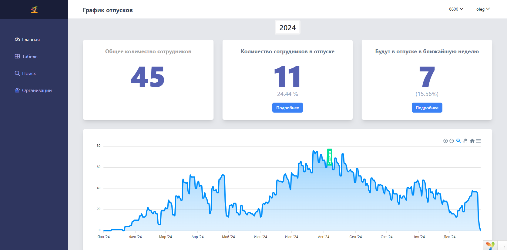
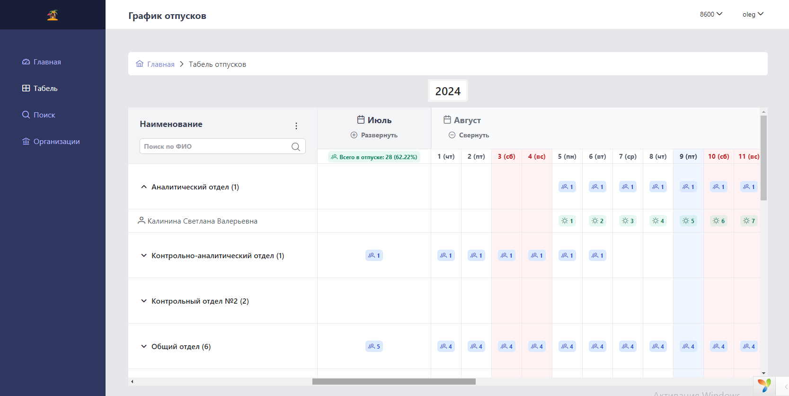
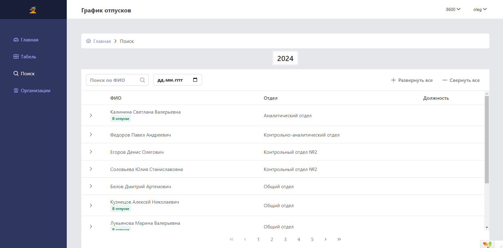

# График отпусков

[](https://github.com/toatall/app-vacations/actions/workflows/deploy.yml)


Приложение для демонстрации информации об отпусках.

Возможно переключение организации в правом верхнем меню.

Главная страница представляет статистические данные об отпусках сотрудников. 

Страница "Табель" показывает отпуска сгруппированные по отделам и месяцам. Каждую группу возможно развернуть для просмотра более детальной информации.

Страница "Поиск" помогает найти информацию по отпускам по сотруднику или по дате отпуска.





**В качестве базового приложения использован https://github.com/tbreuss/pingcrm-yii2**

## Установка

Clone the repo locally:

```sh
git clone https://github.com/toatall/app-vacations app-vacations
cd app-vacations
```

Install PHP dependencies:

```sh
composer install
```

Install NPM dependencies:

```sh
npm ci
```

Build assets:

```sh
npm run css-dev
npm run dev
```

Create Postgres database. 

Run database migrations:

```sh
php yii migrate
```

Run database seeder:

```sh
php yii db/seed
```

Run the dev server (the output will give the address):

```sh
php yii serve
```

You're ready to go! Visit Ping CRM in your browser, and login with:

- **Username:** johndoe@example.com
- **Password:** secret

## Running tests

To run the Ping CRM tests, run:

```
(to be done)
```

## Requirements

- PHP >=7.4.0
- Node.js & NPM
- Postgres

## Extending this project

The following steps are required when extending this project with new features.

### In the backend

- add new controller, that extends from inertia controller
- add one ore more actions
- return from the actions with a call to the inertia render method   

~~~php
<?php

namespace app\controllers;

use tebe\inertia\web\Controller;

class CustomController extends Controller
{
    public function actionIndex()
    {
        $params = [
            'data' => [],
        ];
        return $this->inertia('demo/index', $params);
    }
}
~~~

You can find more information at <https://github.com/tbreuss/yii2-inertia>.

### In the frontend

- add a new page under `resources/js/Pages` for each controller action you added in the backend 
- copy&paste one of the existing page examples
- implement and/or extend Vue.js stuff as needed
- use frontend tooling as described here and in package.json

You can find more information at <https://inertiajs.com>.

## Credits
- Original work by Jonathan Reinink (@reinink) and contributors
- Port to Yii 2 by Thomas Breuss (@tbreuss)
- Modified by @toatall (https://github.com/toatall)
